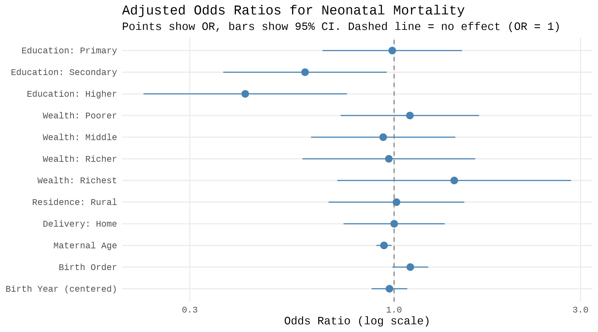
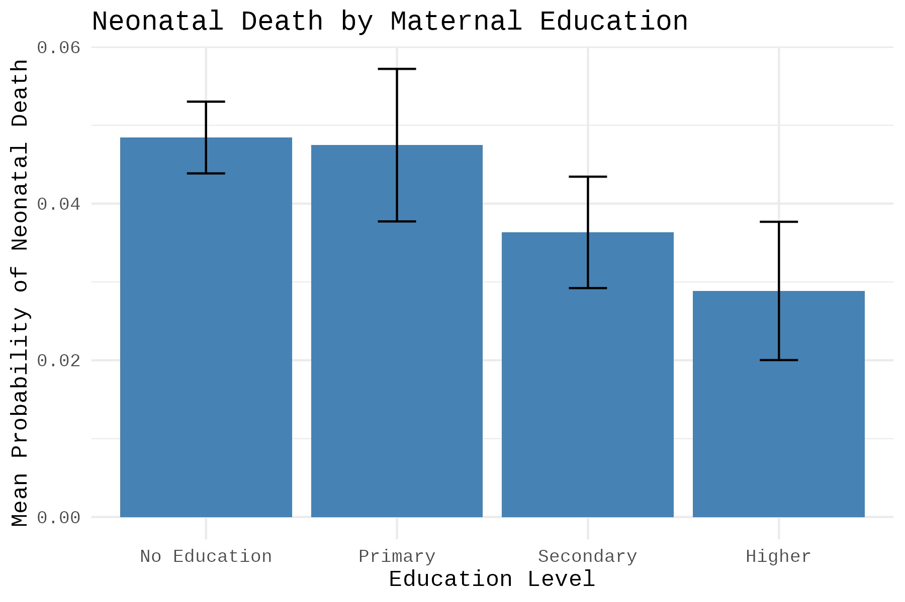
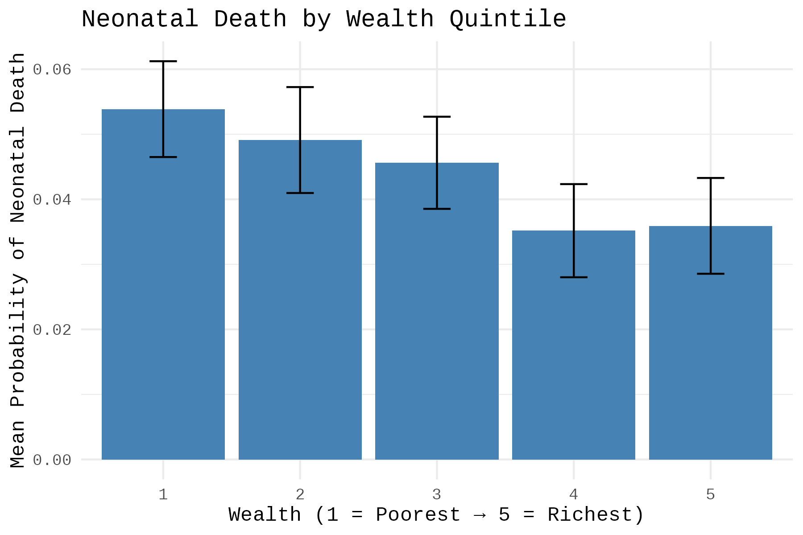

# Maternal Education and Neonatal Survival in Pakistan

This project looks at what predicts neonatal mortality in Pakistan, using survey-weighted descriptive statistics and logistic regression on the 2017-18 Pakistan Demographic and Health Survey (DHS).

## Overview

Neonatal mortality, defined as death within the first 28 days of life, is still a major public health problem in Pakistan despite progress on other child health indicators. This project looks at how maternal education, household wealth, urban/rural residence, place of delivery, maternal age, and birth order relate to neonatal death, using nationally representative DHS data and accounting for the survey's sampling design (clustering, stratification, and weighting).

Maternal education came out as the strongest and most consistent predictor of neonatal mortality — and the relationship isn't simply linear. Mothers with **secondary or higher education** have substantially lower odds of neonatal death than mothers with no formal education, and that relationship holds after adjusting for wealth, residence, delivery setting, maternal age, and birth order. Primary education alone, however, showed no significant protective effect — the benefit only emerges at secondary schooling and above. Household wealth and urban/rural residence look like strong predictors in the raw descriptive statistics, but lose statistical significance once maternal education is in the model, suggesting education is picking up on broader disadvantages that wealth or residence alone don't fully capture.

## Data

This analysis uses the **Birth Recode file (PKBR71)** from the **2017-18 Pakistan Demographic and Health Survey**, a nationally representative household survey with a stratified two-stage sampling design (clusters selected by probability proportional to size, then households within clusters).

- **Unit of analysis:** birth (n = 50,495)
- **Outcome:** `neonatal_death`, a binary indicator built from survival status (`b5`) and age at death in months (`b7`, DHS's imputed age-at-death variable). Coded 1 if a child died in the first month of life (`b7 == 0`, DHS's convention for the neonatal interval), 0 if survived, and set to missing when there wasn't enough information to classify the outcome.

| Variable | Description |
|---|---|
| `b5`, `b7` | Child survival status; age at death |
| `v106` | Maternal education level |
| `v190` | Household wealth quintile |
| `v025` | Urban / rural residence |
| `m15` | Place of delivery (recoded into facility vs. home) |
| `v012` | Maternal age at time of survey |
| `bord` | Birth order |
| `b2` | Birth year |
| `v005`, `v021`, `v022` | Survey weight, primary sampling unit, strata (for `svydesign`) |

DHS microdata isn't redistributed in this repo. To reproduce the analysis, request the Pakistan 2017-18 Birth Recode (PKBR71) dataset through the [DHS Program data request portal](https://dhsprogram.com/data/), then place `PKBR71FL.DTA` in a local `/data` folder before running the notebook.

## Methods

- Survey design specified with `survey::svydesign()` (PSU = `v021`, strata = `v022`, weights = `v005 / 1,000,000`), consistent with DHS analysis guidelines
- Descriptive comparisons (neonatal mortality by education, wealth, residence) estimated with `svyby()` and reported with 95% confidence intervals
- Multivariable model: survey-weighted logistic regression (`svyglm()`, quasibinomial family) predicting neonatal death from maternal education, wealth, residence, delivery type, maternal age, birth order, and birth year (mean-centered)
- Results reported as odds ratios with 95% confidence intervals

## Results

**Adjusted odds ratios for all covariates:**

Points show the odds ratio, bars show the 95% confidence interval, and the dashed line marks no effect (OR = 1). Education (secondary, higher) and maternal age are the only predictors whose intervals don't cross 1.

**Neonatal mortality by maternal education (unadjusted):**

The threshold pattern is visible even before adjustment: mortality is nearly flat between "no education" and "primary," then drops at "secondary" and again at "higher," the same pattern that survives in the adjusted model above.

**Neonatal mortality by wealth quintile (unadjusted):**

Wealth shows a visible gradient on its own, but this association does not persist in the adjusted model, likely because wealth is highly correlated with maternal education, which absorbs most of the predictive signal once both are in the model together.

## Key Findings

- Maternal education is the strongest predictor of neonatal mortality after adjustment. Mothers with **secondary education** had **41% lower odds** of neonatal death (OR = 0.59, 95% CI: 0.37–0.96, p = 0.033), and mothers with **higher education** had **57% lower odds** (OR = 0.43, 95% CI: 0.24–0.77, p = 0.005), relative to mothers with no education. **Primary education alone showed no significant effect** (OR = 0.99, 95% CI: 0.66–1.49) — the protective effect only emerges at secondary schooling and above.
- **Maternal age** was independently significant: each additional year of age was associated with **6% lower odds** of neonatal death (OR = 0.94, 95% CI: 0.90–0.99, p = 0.009).
- **Household wealth** shows a strong unadjusted gradient (5.4% mortality for the poorest quintile vs. ~3.5% for the wealthiest) but is not statistically significant once maternal education and other covariates are included — all wealth-quintile confidence intervals cross 1.
- **Urban/rural residence** and **place of delivery** (facility vs. home) are not statistically significant predictors after adjustment.
- **Birth order** shows a weak, borderline association (OR = 1.10, 95% CI: 0.99–1.22, p = 0.076) — suggestive but not conventionally significant.
- Findings are consistent with prior demographic research identifying maternal education as a key driver of child survival outcomes.

## Limitations

This is an observational, cross-sectional analysis, so associations can't be interpreted causally. DHS data is also subject to recall and reporting biases. `v012` (maternal age) reflects age at the time of survey rather than age at each specific birth, which introduces a growing measurement gap for births further in the past — a true age-at-birth variable could be constructed from `v011` and `b3` in future work.

## Author

Jeren Gochyyeva

## References

Sources referenced in the report:

- Ariff, S., Soofi, S. B., Sadiq, K., Feroze, A. B., Khan, S., Jafarey, S. N., Ali, N., & Bhutta, Z. A. (2010). Evaluation of health workforce competence in maternal and neonatal issues in public health sector of Pakistan: an assessment of their training needs. *BMC Health Services Research*, 10(319).
- Bhutta, Z. A., et al. (2013). Reproductive, maternal, newborn, and child health in Pakistan: challenges and opportunities. *PubMed*.
- Caldwell, J. C. (1986). Routes to Low Mortality in Poor Countries. *Population and Development Review*, 12(2).
- Dhaded, S. M., et al. (2022). The causes of preterm neonatal deaths in India and Pakistan (PURPOSe): a prospective cohort study. *The Lancet Global Health*, 10(11).
- Lutz, W., & Kebede, E. (2018). Education and Health: Redrawing the Preston Curve. *Population and Development Review*, 44(2).
- Muzzamil, M., et al. (2022). The survival rate of neonates in Pakistan: Problems in health care access, quality and recommendations. *PMC*.
- Our World in Data (2020). Estimated maternal mortality ratio, processed from UN MMEIG data.
- UNICEF (2026). Levels and trends in child mortality.
- World Bank Gender Data Portal (2026). Literacy rate (%).
- World Health Organization (2024). Newborn mortality.
